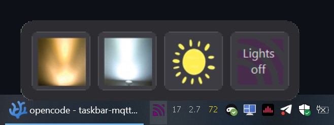

# Taskbar MQTT Client

A tiny portable Windows tray app that lives in the notification area and publishes pre-configured MQTT messages at the click of a button. Configurable 1–9 buttons, each with its own topic, payload, QoS, retain flag and custom icon.




## Quick start

1. Copy `dist\TaskbarMqtt_Setup_v1.9.0.exe` anywhere on your machine.
2. Run it. The app starts silently in the notification area (bottom-right of the taskbar).
3. Right-click the tray icon → **Settings…**.
4. Fill in the **Broker** tab (host, port, credentials, TLS) and click **Test connection** to verify.
5. In the **Buttons** tab, define up to 9 buttons — each with a label, MQTT topic, payload, QoS, retain, and an optional custom icon (PNG / JPG / ICO).
6. **OK** to save. `config.json` is written next to the executable (portable, no registry footprint except optional autostart).

## How to use

- **Popup-panel mode** (default): one tray icon. **Left-click** it to open a small floating panel with your buttons. Click a button to publish. The panel closes when it loses focus or the mouse leaves it.
- **Multi-icon mode**: one tray icon per button. **Left-click** an icon to publish directly.

Right-click any tray icon for:

- **Settings…** — open the configuration dialog

    

- **Quit** — exit the app

## Settings

### General
- **Display mode** — popup panel from one tray icon, or one tray icon per button
- **Popup size** — 25% to 200% in 25% steps; greyed out in multi-icon mode
- **Popup tooltips** — enable/disable and optionally show payload; greyed out in multi-icon mode
- **Popup stays open on click** — keep the popup visible after publishing
- **Custom tray icon** — optional path to `.ico`, `.png`, `.jpg`, `.bmp` for the main tray icon (popup mode)
- **Stretch, rounded corners, White→Transparent, Black→Transparent** — tray icon appearance options
- **Start with Windows** — toggle autostart via `HKCU\…\Run`

Settings are organized into grouped sections (MODE, POPUP, TRAY ICON, STARTUP). Popup-related controls are automatically greyed out when multi-icon mode is selected.

### Broker
- **Host / Port / Username / Password / Client ID / Keep-alive / Connection timeout**
- **Use TLS** — enables encrypted connection
- **Allow invalid / self-signed TLS certificates** — checked by default; uncheck to enforce certificate validation

Click **Test connection** in the Broker tab to verify settings before saving.

### Buttons (per row)
- **Label** — shown in tooltip / tray tooltip; falls back to the button's 1-based number when empty
- **Topic** — the MQTT topic to publish to (required)
- **Payload, QoS, Retain** — arranged on one line: payload field, then QoS dropdown, then Retain checkbox
- **Icon** — optional path to `.ico`, `.png`, `.jpg`, `.bmp`. PNGs/JPGs are auto-resized to fit the tray and the popup button. When empty, the button number (1–9) is shown instead.
- **Stretch image** — when checked the icon fills the whole button; when unchecked it keeps its aspect ratio
- **White→Transparent / Black→Transparent** — per-button

Buttons are added and removed dynamically in the Buttons tab using the **+ Add Button** and **✕** buttons (minimum 1, maximum 9).

## Config file format

`config.json` is created on first launch and re-written on every **Apply** / **OK** in Settings. It lives next to `TaskbarMqtt.exe` (portable mode). When installed in `Program Files`, the app falls back to `%LOCALAPPDATA%\TaskbarMqtt\config.json` because the install directory is read-only.

The file is hand-editable; changes take effect on next launch.

## Build from source

Requirements: .NET SDK 9 (or 8) with NuGet. Restore assemblies for .NET Framework 4.8 are pulled in automatically via the `Microsoft.NETFramework.ReferenceAssemblies.net48` NuGet package.

```bash
dotnet build src/TaskbarMqtt/TaskbarMqtt.csproj -c Release
# Output: src/TaskbarMqtt/bin/Release/TaskbarMqtt.exe
```

The build embeds `MQTTnet` and `Newtonsoft.Json` into the .exe via Costura.Fody, so the final `TaskbarMqtt.exe` (~470 KB) runs on any Windows 10/11 machine without additional runtime installation. `.NET Framework 4.8` must be present (it ships with Windows 10/11 and is updated automatically).

## Project structure

```
src/TaskbarMqtt/
  Program.cs            # Entry, single-instance mutex, message-only window for 2nd-instance
  App/
    TrayContext.cs      # ApplicationContext: owns NotifyIcons, popup, MQTT, context menu
    AutoStart.cs        # HKCU\…\Run helper
  Config/
    AppConfig.cs        # POCOs: BrokerSettings, ButtonConfig, AppConfig
    ConfigStore.cs      # JSON load/save next to .exe
  Mqtt/
    MqttService.cs      # MQTTnet v4 wrapper: connect, publish, auto-reconnect
  UI/
    PopupForm.cs        # Borderless hover panel
    SettingsForm.cs     # Tabbed settings dialog (General / Broker / Buttons)
  Assets/
    app.ico             # Tray icon (multi-resolution 16/32/48/64)
    button-default.ico  # Default button icon
```

## Regenerating the tray and button icons

Only needed if you want to modify the built-in `app.ico` (tray icon) or `button-default.ico` (default button icon). The source `.png` files and the generation script are in the repository root; run:

```powershell
powershell -ExecutionPolicy Bypass -File generate-icons.ps1
```

Produces multi-resolution `.ico` files (16/32/48/64) that are then embedded into the assembly at build time.

## License

MIT. Third-party: MQTTnet (MIT), Newtonsoft.Json (MIT), Costura.Fody (MIT).

## Version history

- **1.9.0** — Grouped General tab sections with grey-out logic; Retain moved to Payload line in button rows; popup image centering fixes; watermark scaling fix; rounded corners via SetClip approach; per-button StretchImage; aspect-ratio preserving icon display; custom tray icon preview.

---

**Keywords:** MQTT client, Windows tray app, notification area, IoT button, home automation, smart home, MQTT publisher, Windows taskbar, portable MQTT, dark mode, .NET Framework 4.8, WinForms, auto-reconnect, TLS support, custom icons, multi-icon tray.